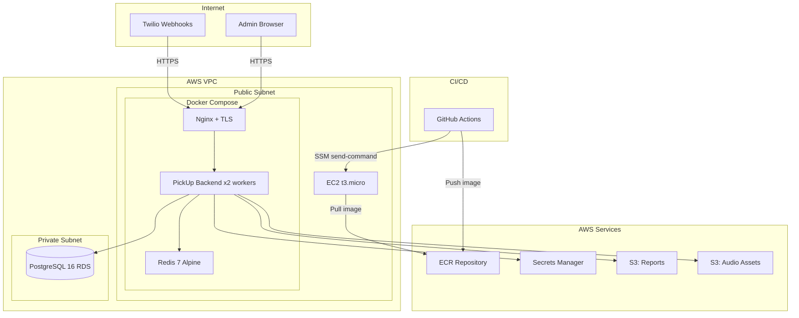
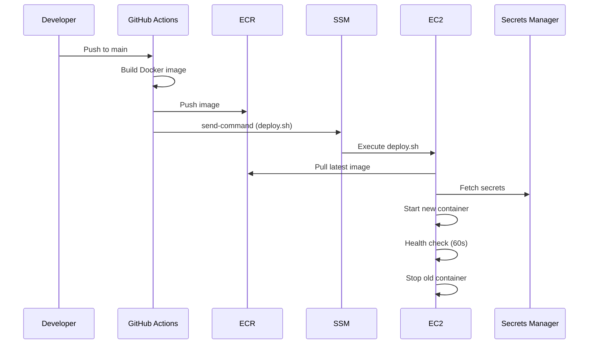

# Design Document: AWS Migration

## Overview

This design describes the migration of the PickUp AI IVR Receptionist application from Railway to AWS. The migration transforms the application from a single-process, file-based architecture to a distributed, cloud-native deployment while preserving all existing functionality.

Key transformations:
- **Database**: SQLite → PostgreSQL 16 on RDS via SQLAlchemy + Alembic
- **Session State**: In-memory Python dicts → Redis 7 with JSON serialization
- **File Storage**: Local filesystem → S3 (reports + audio assets)
- **Secrets**: Fernet-encrypted DB values → AWS Secrets Manager
- **Infrastructure**: Railway → EC2 + Docker Compose (Terraform-managed)
- **CI/CD**: Railway auto-deploy → GitHub Actions + ECR + SSM

The AlwaysPrint project serves as the reference architecture for Terraform module structure, Docker Compose patterns, and GitHub Actions workflows.

## Architecture

### High-Level Architecture Diagram



### Deployment Flow



### Network Architecture

- **VPC**: 10.0.0.0/16 with 2 AZs
- **Public Subnets**: 10.0.1.0/24, 10.0.2.0/24 — EC2, NAT Gateway
- **Private Subnets**: 10.0.3.0/24, 10.0.4.0/24 — RDS (multi-AZ subnet group)
- **Security Groups**:
  - `sg-web`: Inbound 80, 443 from 0.0.0.0/0
  - `sg-backend`: Inbound from Nginx container only (internal Docker network)
  - `sg-rds`: Inbound 5432 from `sg-web` only
- **No SSH**: Access exclusively via SSM Session Manager

## Components and Interfaces

### 1. Terraform Modules

Following the AlwaysPrint reference structure:

```
Cloud/
  terraform/
    main.tf              # Provider config + module composition
    variables.tf         # All variable declarations
    outputs.tf           # Output values
    backend.tf           # S3 remote state + DynamoDB locking
    dev.tfvars           # Dev environment values
    prod.tfvars          # Prod environment values
    setup.sh             # Initial bootstrap (creates state bucket + lock table)
    modules/
      networking/        # VPC, subnets, IGW, NAT GW, route tables, SGs
      ecr/               # ECR repository + lifecycle (max 10 untagged)
      rds/               # PostgreSQL 16, private subnet, encrypted, 7-day backups
      ec2/               # EC2 instance + IAM role + user_data.sh.tpl
      secrets/           # Secrets Manager + random DB password (24+ chars)
      s3/                # Two buckets: reports + audio (versioned, no public access)
```

**Module Interfaces:**

| Module | Inputs | Outputs |
|--------|--------|---------|
| networking | vpc_cidr, azs, environment | vpc_id, public_subnet_ids, private_subnet_ids, sg_web_id, sg_rds_id |
| ecr | repository_name, max_untagged | repository_url, repository_arn |
| rds | instance_class, allocated_storage, db_name, subnet_ids, sg_id, password | endpoint, port, db_name |
| ec2 | instance_type, subnet_id, sg_id, iam_profile, user_data | instance_id, public_ip |
| secrets | environment, secret_values (TWILIO_*, OPENAI_API_KEY, RESEND_API_KEY, RESEND_FROM, ELEVENLABS_API_KEY, GOOGLE_TTS_API_KEY, ADMIN_PASSWORD, SECRET_KEY, DATABASE_URL) | secret_arn, secret_name |
| s3 | environment, bucket_names | reports_bucket_name, audio_bucket_name, reports_bucket_arn, audio_bucket_arn |

### 2. Application Layer Refactoring

#### 2.1 Config Module (`src/config.py`)

**Current**: Reads from Fernet-encrypted SQLite `config` table, falls back to env vars.

**New**: Reads from AWS Secrets Manager at startup, caches in module-level dict.

```python
# New interface
class SecretsConfig:
    _cache: dict[str, str] = {}
    
    @classmethod
    def load(cls) -> None:
        """Fetch all secrets from Secrets Manager. Called once at startup."""
        ...
    
    @classmethod
    def get(cls, key: str, default: str = "") -> str:
        """Read a secret value from the in-memory cache."""
        ...
```

**Secrets Manager key-value structure** (single JSON secret per environment):
```json
{
  "TWILIO_ACCOUNT_SID": "AC...",
  "TWILIO_AUTH_TOKEN": "...",
  "TWILIO_API_KEY_SID": "SK...",
  "TWILIO_API_KEY_SECRET": "...",
  "TWILIO_TWIML_APP_SID": "AP...",
  "TWILIO_VERIFY_SID": "VA...",
  "OPENAI_API_KEY": "sk-proj-...",
  "RESEND_API_KEY": "re_...",
  "RESEND_FROM": "AI Receptionist <noreply@...>",
  "ELEVENLABS_API_KEY": "sk_...",
  "GOOGLE_TTS_API_KEY": "AIza...",
  "ADMIN_PASSWORD": "...",
  "SECRET_KEY": "...",
  "DATABASE_URL": "postgresql://..."
}
```

Note: `SECRET_KEY` is retained in Secrets Manager for Flask session signing (`app.secret_key`), but is no longer used for Fernet encryption of credentials. `ADMIN_PASSWORD` is used for the initial admin setup flow. `RESEND_FROM` stores the sender address for transactional emails.

The existing accessor functions (`account_sid()`, `auth_token()`, etc.) remain as the public API but delegate to `SecretsConfig.get()` internally.

#### 2.2 Database Layer (`src/db.py`)

**Current**: Raw SQLite with `sqlite3.connect()`, thread lock, manual SQL.

**New**: SQLAlchemy ORM with connection pooling + Alembic migrations.

```python
# New structure
src/
  models/
    __init__.py          # SQLAlchemy Base, engine, session factory
    config.py            # Config model
    report.py            # Report model
    use_case.py          # UseCase + Topic models
    user.py              # User, Role, UserUseCase models
    caller_profile.py    # CallerProfile model
  db.py                  # Backward-compatible function API (delegates to models)
  alembic/
    env.py
    versions/
      001_initial_schema.py
```

Connection pooling config:
- `pool_size=2` (min connections)
- `max_overflow=8` (up to 10 total)
- `pool_pre_ping=True` (connection health check)
- `pool_recycle=3600` (recycle connections after 1 hour)

Startup retry logic:
- Exponential backoff: 1s → 2s → 4s (3 attempts max)
- On failure: log error + raise `SystemExit(1)`

#### 2.3 Session State (`src/session_store.py`)

**Current**: Module-level Python dicts in `state.py`.

**New**: Redis-backed store with JSON serialization.

```python
class SessionStore:
    """Redis-backed call session state."""
    
    def get_conversation(self, call_sid: str) -> list[dict]:
        ...
    
    def set_conversation(self, call_sid: str, messages: list[dict]) -> None:
        ...
    
    def get_collected_info(self, call_sid: str) -> dict:
        ...
    
    def set_collected_info(self, call_sid: str, info: dict) -> None:
        ...
    
    def add_outbound_call(self, room: str, call_sid: str) -> None:
        ...
    
    def mark_failed_room(self, room: str) -> None:
        ...
    
    def mark_briefed_room(self, room: str) -> None:
        ...
    
    def get_machine_count(self, room: str) -> int:
        ...
    
    def increment_machine_count(self, room: str) -> int:
        ...
    
    def mark_intro_played(self, call_sid: str) -> None:
        ...
    
    def has_intro_played(self, call_sid: str) -> bool:
        ...
```

Redis key structure:
- `session:{call_sid}:conversation` — JSON list (capped at 50 messages)
- `session:{call_sid}:info` — JSON object
- `outbound:{room}` — string (call_sid)
- `room:failed:{room}` — exists flag
- `room:briefed:{room}` — exists flag
- `room:machine:{room}` — integer counter
- `intro:{call_sid}` — exists flag

All keys have a 2-hour TTL.

#### 2.4 File Storage (`src/storage.py`)

**Current**: `reports.py` writes JSON + MP3 to `data/reports/`. `routes/media.py` serves WAV from `assets/`.

**New**: S3-backed storage with pre-signed URLs for audio.

```python
class S3Storage:
    """S3-backed file storage for reports and audio."""
    
    def upload_report(self, report_id: str, data: dict) -> None:
        """Upload report JSON to S3."""
        ...
    
    def upload_audio(self, report_id: str, audio_bytes: bytes, suffix: str = ".mp3") -> None:
        """Upload call recording to S3."""
        ...
    
    def get_report(self, report_id: str) -> dict | None:
        """Download and parse report JSON from S3."""
        ...
    
    def get_audio_url(self, asset_key: str, expiry: int = 3600) -> str:
        """Generate pre-signed URL for audio asset (1-hour expiry)."""
        ...
    
    def upload_with_retry(self, bucket: str, key: str, body: bytes, retries: int = 2) -> None:
        """Upload with retry logic (2 retries, 1s delay)."""
        ...
```

S3 key structure:
- Reports bucket: `reports/{report_id}.json`, `reports/{report_id}.mp3`, `reports/{report_id}.recording.mp3`
- Audio bucket: `assets/intro.wav`, `assets/wait-music.wav`, `assets/wait-music-{use_case_id}.wav`

#### 2.5 Docker Configuration

```dockerfile
# Dockerfile
FROM python:3.11-slim

RUN apt-get update && apt-get install -y --no-install-recommends \
    ffmpeg \
    && rm -rf /var/lib/apt/lists/*

WORKDIR /app
COPY requirements.txt .
RUN pip install --no-cache-dir -r requirements.txt

COPY src/ ./src/
COPY alembic/ ./alembic/
COPY alembic.ini .

EXPOSE 8000
CMD ["gunicorn", "--chdir", "src", "app:app", "--bind", "0.0.0.0:8000", \
     "--workers", "${GUNICORN_WORKERS:-1}", "--timeout", "120"]
```

Docker Compose services:
- `backend`: PickUp app (port 8000, health check: `GET /health`)
- `redis`: Redis 7 Alpine (port 6379, health check: `redis-cli ping`)
- `nginx`: Reverse proxy + TLS (ports 80, 443)
- `certbot`: Certificate renewal

#### 2.6 GitHub Actions Workflows

Two workflows following AlwaysPrint patterns:

**deploy-backend-dev.yml**: Triggers on push to `main` (path filter excludes `*.md`, `docs/**`, `terraform/**`). Builds → pushes to ECR → SSM deploy.

**deploy-backend-prod.yml**: Triggers on `workflow_dispatch` only. Same build+deploy flow targeting PROD.

Both workflows:
1. Configure AWS credentials (OIDC or access keys)
2. Login to ECR
3. Build and push Docker image with commit SHA tag
4. SSM send-command to EC2 (timeout 300s)
5. deploy.sh on EC2: pull image → start new container → health check (60s) → stop old

#### 2.7 Data Migration Script

A standalone Python script (`scripts/migrate_railway_to_aws.py`) that:
1. Connects to source SQLite DB
2. Connects to target PostgreSQL via SQLAlchemy
3. Migrates tables in dependency order: roles → users → use_cases → topics → user_use_cases → caller_profiles → config → reports
4. Decrypts Fernet values and stores them in Secrets Manager
5. Uploads report files (JSON + MP3) to S3
6. Handles idempotency (skips existing records)
7. Outputs summary with counts per table

### 3. Health Check Endpoint

New endpoint at `GET /health` returning:
```json
{
  "status": "healthy",
  "database": "connected",
  "redis": "connected",
  "timestamp": "2024-01-01T00:00:00Z"
}
```

Returns HTTP 200 if all checks pass, HTTP 503 if any dependency is down.

## Data Models

### SQLAlchemy Models (PostgreSQL)

```python
# models/__init__.py
from sqlalchemy import create_engine
from sqlalchemy.orm import DeclarativeBase, sessionmaker

class Base(DeclarativeBase):
    pass

# Engine created at startup with connection pooling
engine = create_engine(
    DATABASE_URL,
    pool_size=2,
    max_overflow=8,
    pool_pre_ping=True,
    pool_recycle=3600,
)
Session = sessionmaker(bind=engine)
```

#### Config Table
```python
class Config(Base):
    __tablename__ = "config"
    key = Column(String, primary_key=True)
    value = Column(Text, nullable=True)
```

#### Reports Table
```python
class Report(Base):
    __tablename__ = "reports"
    id = Column(String(16), primary_key=True)
    datetime = Column(String)
    caller_number = Column(String)
    caller_name = Column(String)
    topic = Column(String)
    language = Column(String)
```

#### Use Cases + Topics
```python
class UseCase(Base):
    __tablename__ = "use_cases"
    id = Column(String, primary_key=True)
    name = Column(String, nullable=False)
    industry = Column(String)
    url = Column(String)
    forward_to = Column(String)
    voice_en = Column(String)
    voice_es = Column(String)
    slogan_en = Column(String)
    slogan_es = Column(String)
    is_demo = Column(Integer, default=0)
    demo_code = Column(String)
    ivr_type = Column(String, default="topics")
    system_prompt = Column(Text)
    system_prompt_es = Column(Text)
    knowledge_base = Column(Text)
    
    topics = relationship("Topic", back_populates="use_case", cascade="all, delete-orphan")

class Topic(Base):
    __tablename__ = "topics"
    id = Column(Integer, primary_key=True, autoincrement=True)
    use_case_id = Column(String, ForeignKey("use_cases.id", ondelete="CASCADE"), nullable=False)
    key = Column(String, nullable=False)
    digit = Column(String)
    meeting_type = Column(Integer, default=0)
    label_en = Column(String)
    label_es = Column(String)
    menu_text_en = Column(String)
    menu_text_es = Column(String)
    greeting_en = Column(String)
    greeting_es = Column(String)
    system_extra_en = Column(String)
    system_extra_es = Column(String)
    questions_en = Column(Text, default="[]")
    questions_es = Column(Text, default="[]")
    
    use_case = relationship("UseCase", back_populates="topics")
    __table_args__ = (UniqueConstraint("use_case_id", "key"),)
```

#### Users + Roles
```python
class Role(Base):
    __tablename__ = "roles"
    id = Column(Integer, primary_key=True, autoincrement=True)
    name = Column(String, unique=True, nullable=False)

class User(Base):
    __tablename__ = "users"
    id = Column(Integer, primary_key=True, autoincrement=True)
    first_name = Column(String, nullable=False)
    last_name = Column(String, nullable=False)
    email = Column(String, unique=True, nullable=False)
    phone = Column(String)
    password_hash = Column(String, nullable=False)
    role_id = Column(Integer, ForeignKey("roles.id"), nullable=False)
    email_verified = Column(Integer, default=0)
    phone_verified = Column(Integer, default=0)
    is_active = Column(Integer, default=0)
    email_token = Column(String)
    created_at = Column(String, server_default=func.now())
    
    role = relationship("Role")

class UserUseCase(Base):
    __tablename__ = "user_use_cases"
    user_id = Column(Integer, ForeignKey("users.id", ondelete="CASCADE"), primary_key=True)
    use_case_id = Column(String, ForeignKey("use_cases.id", ondelete="CASCADE"), primary_key=True)
```

#### Caller Profiles
```python
class CallerProfile(Base):
    __tablename__ = "caller_profiles"
    phone = Column(String, primary_key=True)
    use_case_id = Column(String, ForeignKey("use_cases.id"), primary_key=True)
    profile_json = Column(Text, default="{}")
    updated_at = Column(String)
```

### Redis Data Structures

| Key Pattern | Type | TTL | Content |
|-------------|------|-----|---------|
| `session:{call_sid}:conversation` | String (JSON) | 2h | `[{"role":"system","content":"..."},...]` (max 50) |
| `session:{call_sid}:info` | String (JSON) | 2h | `{"name":null,"phone":null,"notes":null,"topic":"","lang":"","caller_from":"","demo_id":null,...}` |
| `outbound:{room}` | String | 2h | `"CA..."` (outbound call SID) |
| `room:failed:{room}` | String | 2h | `"1"` |
| `room:briefed:{room}` | String | 2h | `"1"` |
| `room:machine:{room}` | String (int) | 2h | `"2"` (counter) |
| `intro:{call_sid}` | String | 2h | `"1"` |

### Alembic Migration Strategy

Initial migration (`001_initial_schema.py`) captures the full current schema as PostgreSQL DDL. Subsequent migrations track schema evolution. Alembic runs automatically at app startup via:

```python
from alembic.config import Config as AlembicConfig
from alembic import command

def run_migrations():
    alembic_cfg = AlembicConfig("alembic.ini")
    command.upgrade(alembic_cfg, "head")
```

## Correctness Properties

*A property is a characteristic or behavior that should hold true across all valid executions of a system — essentially, a formal statement about what the system should do. Properties serve as the bridge between human-readable specifications and machine-verifiable correctness guarantees.*

### Property 1: Session state round-trip preservation

*For any* valid call session data (conversation history of 0–50 messages, collected caller info with arbitrary string fields, and room state flags), storing the session in Redis and then retrieving it should produce data identical to the original.

**Validates: Requirements 3.1**

### Property 2: Report storage round-trip preservation

*For any* valid report JSON object (containing timestamp, caller info, conversation history, and summary fields), uploading it to S3 and then downloading it should produce a JSON object identical to the original.

**Validates: Requirements 7.2**

### Property 3: Pre-signed URL correctness

*For any* valid S3 asset key (audio file path), generating a pre-signed URL should produce a URL that references the correct bucket and key, and has an expiration time within the configured 1-hour window.

**Validates: Requirements 7.4**

### Property 4: Data migration preserves all records

*For any* valid set of records across all tables (use_cases, topics, users, roles, user_use_cases, caller_profiles, config, reports), migrating from SQLite to PostgreSQL should preserve all field values without data loss or transformation errors.

**Validates: Requirements 9.2**

### Property 5: Fernet decryption round-trip during migration

*For any* string value that was encrypted with Fernet using a known SECRET_KEY, the migration script's decryption step should recover the original plaintext value exactly.

**Validates: Requirements 9.3**

### Property 6: Migration idempotency

*For any* valid dataset, running the migration script twice against the same target database should produce the same final state as running it once — no duplicate records, no changed values, and identical record counts.

**Validates: Requirements 9.7**

## Error Handling

### Database Connection Failures

| Scenario | Behavior |
|----------|----------|
| Connection fails on startup | Retry with exponential backoff: 1s → 2s → 4s (3 attempts) |
| All retries exhausted | Log error with connection details, raise `SystemExit(1)` |
| Connection fails during request | SQLAlchemy pool handles reconnection via `pool_pre_ping=True` |
| Migration fails on startup | Log failed migration version, `SystemExit(1)` |

### Redis Failures

| Scenario | Behavior |
|----------|----------|
| Redis unavailable during webhook | Log error, return TwiML apology + hangup (< 5s) |
| Session key not found | Initialize fresh session record, continue normally |
| Redis connection timeout | Use 2s connection timeout, fail fast to TwiML fallback |

### S3 Failures

| Scenario | Behavior |
|----------|----------|
| Upload fails | Retry up to 2 times with 1s delay between attempts |
| All upload retries exhausted | Log error, continue without blocking call flow |
| Report download fails | Return HTTP 503 with error message |
| Pre-signed URL generation fails | Log error, return HTTP 500 |

### Secrets Manager Failures

| Scenario | Behavior |
|----------|----------|
| Unreachable at startup | Log secret name + error reason, terminate within 10s |
| Partial secret retrieval | Treat as full failure, terminate process |

### CI/CD Failures

| Scenario | Behavior |
|----------|----------|
| Docker build fails | Mark workflow failed, halt (no deploy) |
| SSM send-command fails/times out (300s) | Mark workflow failed, report step |
| New container fails health check (60s) | Rollback to previous image, report failure |
| Environment mismatch | Reject deployment, report error |

### Data Migration Failures

| Scenario | Behavior |
|----------|----------|
| Single record import fails | Log table + record ID + error, continue |
| Duplicate record detected | Skip without error |
| All records processed with failures | Exit with non-zero code + summary |
| All records processed successfully | Exit with code 0 + summary |

## Testing Strategy

### Unit Tests (Example-Based)

Unit tests cover specific scenarios, edge cases, and error conditions:

- **Config module**: Verify secrets are loaded from Secrets Manager mock, verify startup failure on unreachable SM
- **Database layer**: Verify Alembic migration applies correctly, verify connection retry logic with mocked failures, verify constraint enforcement
- **Session store**: Verify TTL is set on creation, verify fresh session on missing key, verify TwiML fallback on Redis failure
- **S3 storage**: Verify retry logic on upload failure, verify HTTP 503 on download failure
- **Migration script**: Verify summary output format, verify exit codes, verify error logging on bad records
- **Health endpoint**: Verify 200 when all services up, verify 503 when any service down
- **Deploy script**: Verify rollback on health check failure

### Property-Based Tests

Property-based tests verify universal correctness properties using the `hypothesis` library (Python). Each test runs a minimum of 100 iterations with generated inputs.

| Property | Test Description | Generator Strategy |
|----------|-----------------|-------------------|
| Property 1 | Session round-trip | Generate random conversation lists (0–50 messages), random info dicts with optional string fields, random room flags |
| Property 2 | Report round-trip | Generate random report dicts with varying field lengths, unicode content, nested conversation arrays |
| Property 3 | Pre-signed URL | Generate random S3 key strings (valid path characters), verify URL structure |
| Property 4 | Migration preservation | Generate random records for each table type, insert into SQLite, migrate, compare with PostgreSQL |
| Property 5 | Fernet decryption | Generate random strings (including unicode, empty, long), encrypt with Fernet, decrypt via migration logic |
| Property 6 | Migration idempotency | Generate random datasets, run migration twice, compare final state |

**Configuration:**
- Library: `hypothesis` (Python)
- Minimum iterations: 100 per property
- Each test tagged with: `# Feature: aws-migration, Property {N}: {description}`

### Integration Tests

Integration tests verify end-to-end behavior with real (or localstack) AWS services:

- **Terraform**: `terraform plan` produces expected resources, `terraform validate` passes
- **Docker Compose**: All containers start and pass health checks
- **Deployment**: SSM command executes deploy.sh successfully
- **Database**: Alembic migrations run against real PostgreSQL
- **Redis**: Multi-worker session sharing works correctly
- **S3**: Upload/download of reports and audio files
- **Secrets Manager**: Secret retrieval at startup

### Smoke Tests

Smoke tests verify one-time setup and configuration:

- Terraform modules produce valid plans
- ECR lifecycle policy is configured
- Security groups have no SSH (port 22) rules
- S3 buckets have versioning enabled and public access blocked
- Docker Compose has correct restart policies and health checks
- GitHub Actions workflows have correct triggers and path filters
